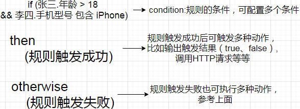
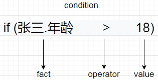

# Devs

Devs是一款功能齐全的规则引擎，支持规则集、决策树、评分卡，并且有完善的监控功能（开发中），后期打算支持规则回溯，时间窗口等等。规则形式以JSON格式保存，表达式引擎为[AviatorScript](https://github.com/killme2008/aviatorscript)，具体技术栈看下面。

# 技术栈

- SpringBoot
- Mybatis
- MySQL
- [AviatorScript](https://github.com/killme2008/aviatorscript)
- Ant Design Pro

# 单个规则元素解释



单个规则的组成有3个基本元素

1. condition：规则的条件，可配置多个条件

2. then：规则触发成功后可触发多种动作，比如输出触发结果（true、false）,调用HTTP请求等等

3. otherwise：规则触发失败也可执行多种动作，参考上面

## condition组成元素



1. fact:真实取值，一般保存在数据库中，可通过反射或者HTTP请求获取

2. operator: 条件运算符，不同字段类型有不同的运算符，比如数字类型的运算符有大于、小于等，字符串类型有包含、半包含等

3. value:值，由用户输入，需要比较的值

## DSL

本项目所有规则的保存统一用JSON格式

```json
{
  "conditions": {
    "and": [
      {
        "fact": "age",
        "operator": "$1>$2",
        "value": 18
      }
    ]
  }
}
```

## Action组成元素（then、otherwise）

触发结果的动作（触发成功then，触发失败otherwise）统一抽象为Action

### 触发动作类型目前分为一下几类

- BOOL: true false
- PRINT: 输出自定义字符串，输出支持添加变量
- HTTP: 接口调用
- STRUCT: 输出结构体，可供下级调用

### DSL

```json
"then or otherwise": [
  {
    "type": "PRINT",
    "value": "你好"
  },
  {
    "type": "HTTP",
    "value": {
      "url": "http://localhost:8888/action1",
      "method": "POST",
      "params": {
        "k11": "v11",
        "k12": "v12"
      }
    }
  }
]
```

## 完整DSL

## DSL

```json
{
  "ruleName": "单个规则名称",
  "desc": "单个规则备注",
  "conditions": {
    "and": [
      {
        "fact": "age",
        "operator": "$1>$2",
        "value": 18
      },
      {
        "fact": "name",
        "operator": "StringMethod.equals($1,$2)",
        "value": "李四"
      }
    ]
  },
  "then": [
    {
      "type": "PRINT",
      "value": "你好"
    },
    {
      "type": "HTTP",
      "value": {
        "url": "http://localhost:8888/action1",
        "method": "POST",
        "params": {
          "k11": "v11",
          "k12": "v12"
        }
      }
    }
  ],
  "otherwise": [
    {
      "type": "HTTP",
      "value": {
        "url": "http://localhost:8888/action2",
        "method": "GET",
        "params": {
          "k21": "v21",
          "k22": "v22"
        }
      }
    }
  ]
}
```

# 模型

上述单个规则是不能直接使用的，要放在规则集、决策树和评分卡中使用。

# 规则集

规则集由上述若干个规则组成，规则集属于**模型**

## DSL

```json
{
  "name": "规则集名称",
  "code": "RS_1",
  "modelId": "模型ID",
  "remark": "备注",
  "rules": [
    {
      "ruleName": "单个规则名称1",
      "desc": "单个规则备注1",
      "conditions": {},
      "then": [],
      "otherwise": []
    },
    {
      "ruleName": "单个规则名称2",
      "desc": "单个规则备注2",
      "conditions": {},
      "then": [],
      "otherwise": []
    } 
  ]
}
```

# 决策树


这个功能后端已经实现，但是由于没有界面，所以暂时从网上找了图片代替。

单个规则只支持与或之前的组合，导致扩展性较低。所以引入决策树，支持多叉树

# 评分卡

类似下面这种，支持权重

| 字段 | 操作符 | 权重 | 分数 |
| ---- | ------ | ---- | ---- |
| 年龄 | >18    | 1    | 1    |
| <=18 | 2      | 1    | 2    |
| 性别 | 男     | 3    | 3    |
| 女   | 4      | 2    | 4    |