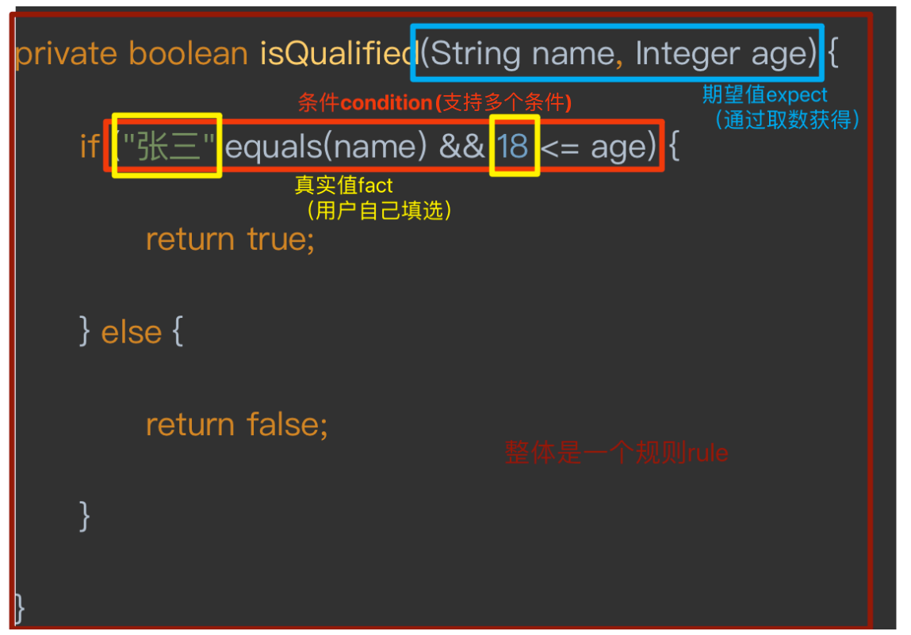
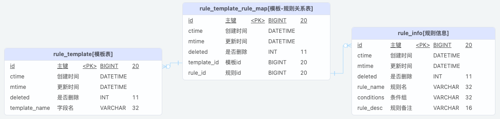
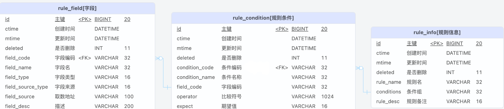
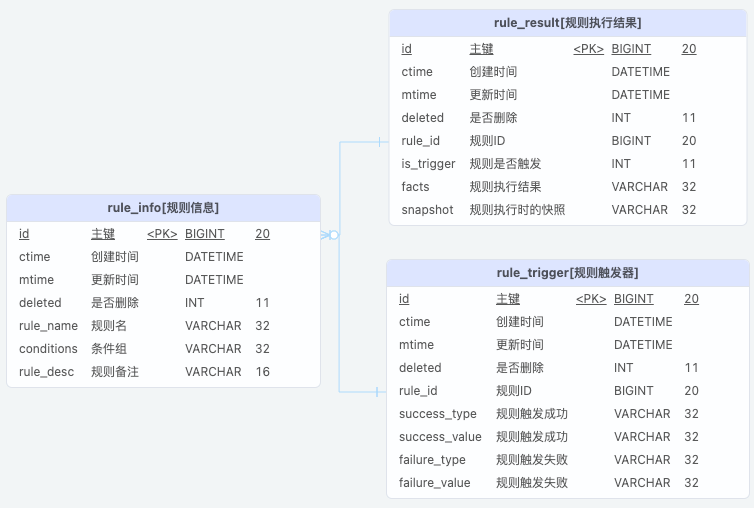

# Devs

Devs是一款轻量级的规则引擎。

# 基础概念

此规则引擎的基础概念有字段、条件、规则等。

其中字段组成条件，条件组成规则，并且支持多个条件通过与或组成一个规则。下面用常见的代码说明各个概念

## 代码举例



## 规则分类

多个规则可组成一个模板，调用接口执行的时候是以模板为维度执行的。

### 模板

| 模板名称 |
| -------- |
| 模板1    |

### 规则模板映射表

| 模板id | 规则id |
| ------ | ------ |
| 1      | 1      |
| 1      | 2      |
| 1      | 3      |

## 规则相关

### 字段

| 字段名称 | 字段编码 | 字段类型 | 取数类型 | 取数路径                      |
| -------- | -------- | -------- | -------- | ----------------------------- |
| name     | 姓名     | STRING   | REFLECT  | engineServiceImpl#testReflect |
| age      | 年龄     | NUMBER   | REFLECT  | engineServiceImpl#testReflect |

### 条件

| 条件名称         | 条件编码     | 字段编码 | 逻辑比较符                         | 期望值 |
| ---------------- | ------------ | -------- | ---------------------------------- | ------ |
| 姓名是否等于张三 | C_NAME_IS_ZS | name     | StringMethod.equals($EXPECT,$FACT) | 张三   |
| 年龄是否大于18岁 | C_AGE_GT18   | age      | NumberMethod.gt($EXPECT,$FACT)     | 18     |

### 规则

| 规则名称         | 条件组                           |
| ---------------- | -------------------------------- |
| 姓名是否等于张三 | C_STRING_EQUALS1                 |
| 年龄是否大于18岁 | C_NUMBER_GE1                     |
| 用户是否符合条件 | C_STRING_EQUALS1 && C_NUMBER_GE1 |

## 规则结果

调用接口执行时，结果会直接通过接口返回。

TODO: 保存规则执行结果

TODO: 添加规则触发器

# ER图

## 模板-规则关系



## 规则相关



## 规则执行结果



# 执行接口

URL:/engine/execute

METHOD:POST

## 入参

| 字段名     | 字段类型           | 是否必填 | 解释   |
| :--------- | :----------------- | :------- | :----- |
| templateId | Long               | TRUE     | 模板ID |
| params     | Map<String,Object> | FALSE    | 参数   |

### 例子

```json
{
  "templateId": 1,
  "params": {
    "userId": 123
  }
}
```

## 出参

验收结果只有是、否、NULL。

执行结果为NULL，则只输出内容，需要手动判断

| 规则名称         | 执行结果 | 条件组                               | 实际取值                   |
| ---------------- | -------- | ------------------------------------ | -------------------------- |
| 姓名是否等于张三 | TRUE     | 姓名是否等于张三                     | "姓名": "张三"             |
| 年龄是否大于18岁 | FALSE    | 年龄是否大于18岁                     | "年龄": 10                 |
| 用户是否符合条件 | FALSE    | 姓名是否等于张三 && 年龄是否大于18岁 | "姓名": "张三", "年龄": 10 |

### 例子

```json
{
  "code": "0000",
  "msg": "success",
  "requestId": "",
  "timestamp": 1637996239325,
  "data": {
    "templateId": 1,
    "params": {},
    "ruleResult": [
      {
        "ruleName": "姓名是否等于张三",
        "trigger": true,
        "conditions": "姓名是否等于张三",
        "facts": {
          "姓名": "张三"
        }
      },
      {
        "ruleName": "年龄是否大于18岁",
        "trigger": false,
        "conditions": "年龄是否大于18岁",
        "facts": {
          "年龄": 10
        }
      },
      {
        "ruleName": "用户是否符合条件",
        "trigger": false,
        "conditions": "姓名是否等于张三 && 年龄是否大于18岁",
        "facts": {
          "姓名": "张三",
          "年龄": 10
        }
      }
    ]
  }
}
```